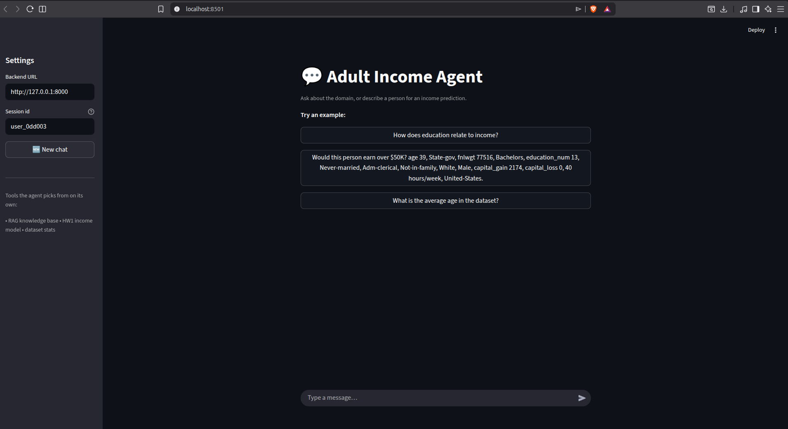
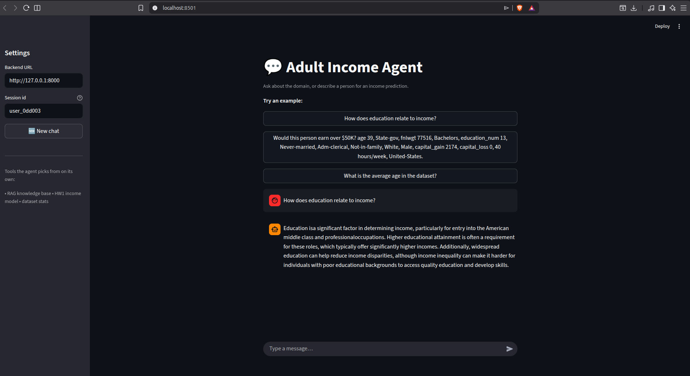
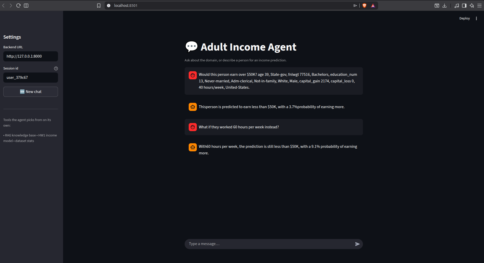
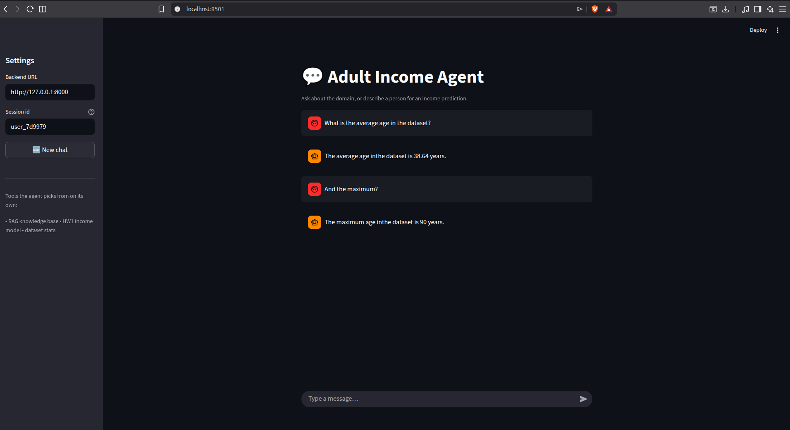

# Hands-on AI – Εργασία 2: «Making Your Model Talk»
**Φοιτητής:** Μάρκος Συρούκης  
**A.M.:** 09325023  
**Εξάμηνο:** 2ο  
**Μάθημα:** Hands-on AI Homework 2 
**Σχολή:** ΣΕΜΦΕ, ΕΜΠ  

---
Agent συνομιλίας (conversational AI agent) για το πεδίο του **US Adult
Census Income**. Συνδυάζει:

- **RAG** πάνω σε βάση γνώσης εγγράφων για ερωτήσεις γνώσης/εννοιών, και
- το **μοντέλο της Εργασίας 1** (XGBoost) για προβλέψεις εισοδήματος,

όλα μέσα από μία ενιαία συνομιλία, εκτεθειμένα μέσω **FastAPI**.

---

## 1. Επισκόπηση Συστήματος

Ο πράκτορας απαντά σε δύο τύπους αιτημάτων μέσα στην ίδια συζήτηση:

1. **Ερωτήσεις γνώσης** για το πεδίο (εισόδημα, εκπαίδευση, μισθολογικό χάσμα
   φύλων, εισοδηματική ανισότητα, αλγοριθμική μεροληψία), απαντώνται με
   **Retrieval-Augmented Generation** πάνω σε τοπική βάση εγγράφων.
2. **Αιτήματα πρόβλεψης**: δίνοντας τα δημογραφικά/εργασιακά χαρακτηριστικά ενός
   ατόμου, ο πράκτορας καλεί το εκπαιδευμένο μοντέλο της Εργασίας 1 και προβλέπει
   αν το ετήσιο εισόδημα ξεπερνά τα **$50K**.

Ο πράκτορας αποφασίζει **αυτόνομα** ποιο εργαλείο θα χρησιμοποιήσει με βάση το
μήνυμα σε φυσική γλώσσα, επομένως ο χρήστης δεν χρειάζεται να δηλώσει «χρησιμοποίησε RAG»
ή «κάνε πρόβλεψη». Διατηρεί επίσης **μνήμη συνομιλίας ανά session**, ώστε
ερωτήσεις-συνέχειες (π.χ. «κι αν δούλευε 60 ώρες;») να απαντώνται σωστά.

Το LLM είναι το **Google Gemini** (`gemini-2.5-flash`) μέσω `langchain-google-genai`.

Η επικοινωνία γίνεται είτε μέσω REST (`/chat`, `/chat/stream`) είτε μέσω μιας
**εφαρμογής συνομιλίας Streamlit** (`utils/streamlit_app.py`) που μιλά στο
`/chat/stream` του backend, δείτε §6.

---

## 2. Αρχιτεκτονική

### Εργαλεία (tools)

Ο πράκτορας έχει πρόσβαση σε **τρία** εργαλεία (`src/tools.py`):

| Εργαλείο | Τι κάνει | Πότε καλείται |
|----------|----------|---------------|
| `retrieve_knowledge` | Ανακτά τα πιο σχετικά αποσπάσματα από τη βάση γνώσης (Chroma + embeddings) | Ερωτήσεις «τι/γιατί/πώς» για το πεδίο |
| `predict_income` | Τρέχει το μοντέλο XGBoost της Εργασίας 1 και επιστρέφει πρόβλεψη + πιθανότητα | Όταν ο χρήστης δίνει χαρακτηριστικά ατόμου |
| `dataset_stats` | Επιστρέφει στατιστικά για στήλη του dataset (μ.ό., κατανομή κλάσεων κ.λπ.) | **(Task 5)** ερωτήσεις για το ίδιο το dataset |

### Δομή γράφου LangGraph

Ο πράκτορας είναι ένας **ReAct agent** χτισμένος με
`langgraph.prebuilt.create_react_agent` (`src/agent.py`):

```
HumanMessage ─▶ [LLM] ──tool_call?──▶ [Tool node] ──▶ [LLM] ──▶ AIMessage (απάντηση)
                  ▲                                      │
                  └──────────────────────────────────────┘   (επανάληψη αν χρειαστεί)
```

- Σε κάθε γύρο το LLM αποφασίζει αν θα καλέσει κάποιο εργαλείο και ποιο.
- Το αποτέλεσμα του εργαλείου επιστρέφει στο LLM, που συνθέτει την τελική απάντηση.
- Η μνήμη υλοποιείται με `MemorySaver` checkpointer, με κλειδί
  `thread_id = session_id`. Έτσι κάθε session έχει ανεξάρτητο ιστορικό
  (μνήμη εντός session).

### Πώς αποφασίζει ποιο εργαλείο να καλέσει

Η δρομολόγηση γίνεται από το ίδιο το LLM, καθοδηγούμενο από ένα **system prompt**
που περιγράφει τα τρία εργαλεία και τους κανόνες χρήσης τους (π.χ. «αν λείπουν
χαρακτηριστικά για πρόβλεψη, ζήτησέ τα αντί να τα εφεύρεις», «σε follow-up
ερωτήσεις ξαναχρησιμοποίησε τα προηγούμενα δεδομένα»). Δεν υπάρχει χειροκίνητη
λογική if/else. Επομένως η επιλογή είναι αυτόνομη (Task 3.1).

---

## 3. Βάση Γνώσης (Knowledge Base)

Τα έγγραφα βρίσκονται στο `data/documents/` και καλύπτουν το πεδίο του Adult
Census Income. Ωστόσο δεν τα αντέγραψα χειροκίνητα, αντίθετα τα κατέβασα και τα καθάρισα
αυτόματα με ένα βοηθητικό script, το `utils/doc_parser.py` (δείτε παρακάτω).

| Έγγραφο | Περιεχόμενο | Πηγή |
|---------|-------------|------|
| `adult.pdf` | Περιγραφή του dataset «Adult / Census Income» (UCI) | [UCI ML Repository](https://archive.ics.uci.edu/dataset/2/adult) |
| `personal_income_in_the_united_states.txt` | Προσωπικό εισόδημα στις ΗΠΑ | [Wikipedia](https://en.wikipedia.org/wiki/Personal_income_in_the_United_States) |
| `educational_attainment_in_the_united_states.txt` | Εκπαιδευτικό επίπεδο & εισόδημα | [Wikipedia](https://en.wikipedia.org/wiki/Educational_attainment_in_the_United_States) |
| `gender_pay_gap_in_the_united_states.txt` | Μισθολογικό χάσμα φύλων | [Wikipedia](https://en.wikipedia.org/wiki/Gender_pay_gap_in_the_United_States) |
| `income_inequality_in_the_united_states.txt` | Εισοδηματική ανισότητα | [Wikipedia](https://en.wikipedia.org/wiki/Income_inequality_in_the_United_States) |
| `algorithmic_bias.txt` | Αλγοριθμική μεροληψία σε μοντέλα ML | [Wikipedia](https://en.wikipedia.org/wiki/Algorithmic_bias) |

**Γιατί επιλέχθηκαν:** καλύπτουν ακριβώς τις έννοιες πίσω από τα χαρακτηριστικά
του μοντέλου (εκπαίδευση, φύλο, ώρες εργασίας, ανισότητα) ώστε ο πράκτορας να
μπορεί να *εξηγήσει* και να *πλαισιώσει* τις προβλέψεις, όχι μόνο να τις παράγει.

### Πώς συλλέχθηκαν: το script `utils/doc_parser.py`

Αντί να κάνω copy-paste το κείμενο από τις ιστοσελίδες, κάτι που πιθανώς σέρνει μαζί
του μενού πλοήγησης, infoboxes, πίνακες, υποσημειώσεις (`[1]`, `[2]`), συνδέσμους
«`[edit]`» κ.λπ. και γεμίζει θόρυβο τα chunks/embeddings, έγραψα έναν μικρό parser
που κατεβάζει τη σελίδα και κρατά μόνο το αναγνώσιμο κείμενο του άρθρου. Έτσι
η βάση γνώσης είναι καθαρή και αναπαραγώγιμη: αρκεί να ξανατρέξω το script. Τέλος μελλοντικά μπορώ εύκολα να προσθέτω και να αφαιρώ κείμενα.

**Τι κάνει / τι αποφεύγει** η κλάση `DocumentParser`:

- **Επιλέγει το σώμα του άρθρου**: για Wikipedia/MediaWiki παίρνει το
  `.mw-parser-output`, αλλιώς πέφτει πίσω σε `<article>` → `<main>` → `<body>`.
- **Πετάει boilerplate tags** πριν την εξαγωγή: `script, style, noscript, nav,
  header, footer, aside, form, figure, figcaption, table, sup` (μενού, πίνακες,
  εικόνες, υποσημειώσεις).
- **Κρατά μόνο** τα tags κειμένου `p, h2, h3, h4, li` σε σειρά ανάγνωσης, και
  **αγνοεί** blocks κάτω από 30 χαρακτήρες (ψίχουλα πλοήγησης, κενά list items).
- **Καθαρίζει το κείμενο** (`_clean`): αφαιρεί δείκτες αναφορών `[1]`/`[23]`,
  υποσημειώσεις `[a]`, συνδέσμους `[edit]`, non-breaking spaces, και μαζεύει τα
  πολλαπλά κενά.
- **Αποθηκεύει** σε `.txt` (UTF-8) ή `.pdf` (μέσω ReportLab με Unicode font
  DejaVuSans, ώστε να επιβιώνουν μη-ASCII χαρακτήρες). Κάθε αρχείο ξεκινά με
  header `# <τίτλος>` + `# Source: <url>`, και το όνομα αρχείου προκύπτει ως
  *slug* του τίτλου, έτσι ένα re-run στο ίδιο URL **αντικαθιστά** αντί να
  δημιουργεί διπλότυπο.

**Όρισμα / χρήση** (CLI): δύο arguments (`url`, `dest_dir`) και υποχρεωτικά **ένα**
από τα `--txt` / `--pdf`:

```bash
python -m utils.doc_parser <url> <dest_dir> --txt    # ή --pdf
```

Οι ακριβείς εντολές που έχτισαν τη συγκεκριμένη βάση γνώσης:

```bash
python -m utils.doc_parser https://en.wikipedia.org/wiki/Personal_income_in_the_United_States        data/documents --txt
python -m utils.doc_parser https://en.wikipedia.org/wiki/Educational_attainment_in_the_United_States data/documents --txt
python -m utils.doc_parser https://en.wikipedia.org/wiki/Gender_pay_gap_in_the_United_States         data/documents --txt
python -m utils.doc_parser https://en.wikipedia.org/wiki/Income_inequality_in_the_United_States      data/documents --txt
python -m utils.doc_parser https://en.wikipedia.org/wiki/Algorithmic_bias                            data/documents --txt
python -m utils.doc_parser https://archive.ics.uci.edu/dataset/2/adult                               data/documents --pdf
```

**Vector store:** τα έγγραφα τεμαχίζονται (chunking), ενσωματώνονται με το μοντέλο
`sentence-transformers/all-MiniLM-L6-v2` και αποθηκεύονται σε **ChromaDB** στο
`data/vector_store/` (~1020 vectors). Το store είναι **persisted στον δίσκο** και
φορτώνεται κατά την εκκίνηση και ως αποτέλεσμα δεν ξαναχτίζεται κάθε φορά (`src/rag.py`).

**Παραδείγματα ερωτήσεων που απαντά το RAG:** «Πώς σχετίζεται η εκπαίδευση με το
εισόδημα;», «Τι είναι το μισθολογικό χάσμα φύλων;», «Πώς εμφανίζεται η αλγοριθμική
μεροληψία;».

---

## 4. Ενσωμάτωση Μοντέλου της Εργασίας 1

- **Μοντέλο:** `XGBClassifier` (το best model της Εργασίας 1), στο
  `models/best_model.pkl`.
- **Artifacts προεπεξεργασίας** (φορτώνονται, δεν ξαναεκπαιδεύονται):
  `models/scaler.pkl`, `models/ohe_encoder.pkl`, `models/preprocessing_meta.pkl`.
- **Είσοδος εργαλείου `predict_income`:** JSON/dict με τα 14 πεδία της απογραφής
  (`age`, `workclass`, `fnlwgt`, `education`, `education_num`, `marital_status`,
  `occupation`, `relationship`, `race`, `sex`, `capital_gain`, `capital_loss`,
  `hours_per_week`, `native_country`).
- **Επεξεργασία:** εφαρμόζεται **ακριβώς η ίδια** προεπεξεργασία με την Εργασία 1
  (one-hot encoding → 64 χαρακτηριστικά, scaling με τον αποθηκευμένο scaler).
- **Έξοδος:** Human readable πρόβλεψη, π.χ.
  `Prediction: <=50K (probability of >$50K: 3.7%)`.

> Τα `best_model.pkl` και `scaler.pkl` είναι **πανομοιότυπα** με αυτά της Εργασίας
> 1· δεν γίνεται refit/retrain, ώστε οι προβλέψεις να ταυτίζονται με το `/predict`
> της Εργασίας 1.

---

## 5. Παραδείγματα Συνομιλιών

**(α) Ανάκτηση γνώσης (RAG):**

```
Χρήστης: How does education relate to income?
Πράκτορας: [καλεί retrieve_knowledge] Η εκπαίδευση είναι καθοριστικός παράγοντας
           για το εισόδημα και την κοινωνική κινητικότητα... (απάντηση θεμελιωμένη
           στα ανακτημένα αποσπάσματα)
```

**(β) Πρόβλεψη + μνήμη συνομιλίας:**

```
Χρήστης: Would this person earn over $50K? age 39, State-gov, fnlwgt 77516,
         Bachelors, education_num 13, Never-married, Adm-clerical,
         Not-in-family, White, Male, capital_gain 2174, capital_loss 0,
         40 hours/week, United-States.
Πράκτορας: [καλεί predict_income] Προβλέπεται <=50K, με πιθανότητα 3.7% για >$50K.

Χρήστης: What if they worked 60 hours per week instead?
Πράκτορας: [ξανακαλεί predict_income με ενημερωμένο πεδίο] Με 60 ώρες/εβδομάδα η
           πρόβλεψη παραμένει <=50K, αλλά η πιθανότητα για >$50K ανεβαίνει στο 9.1%.
```

**(γ) Στατιστικά dataset (bonus):**

```
Χρήστης: What is the average age in the dataset?
Πράκτορας: [καλεί dataset_stats] Ο μέσος όρος ηλικίας στο dataset είναι 38.64 έτη.
```

### Σενάρια επίδειξης συνδυασμού (RAG + πρόβλεψη) — βήμα-βήμα

> **Προϋπόθεση:** ο server τρέχει (`python main.py`) και υπάρχει έγκυρο
> `GOOGLE_API_KEY` με διαθέσιμο quota. Κρατήστε **το ίδιο `session_id`** σε όλα
> τα turns ενός σεναρίου, ώστε να ενεργοποιηθεί η μνήμη συνομιλίας.
>
> Τα δύο εργαλεία (`predict_income`, `retrieve_knowledge`) είναι
> **ανεξάρτητα**: το RAG δεν τροφοδοτεί και δεν μεταβάλλει την έξοδο του
> μοντέλου. Η αξία του συνδυασμού είναι η **θεμελίωση/εξήγηση** της πρόβλεψης,
> όχι η «διόρθωσή» της.

**Σενάριο 1 — Πρόβλεψη και μετά εξήγηση μέσω RAG**

*Turn 1 — πρόβλεψη:*
```bash
curl -X POST http://127.0.0.1:8000/chat -H "Content-Type: application/json" -d '{
  "message": "Would this person earn over $50K? age 39, State-gov, fnlwgt 77516, Bachelors, education_num 13, Never-married, Adm-clerical, Not-in-family, White, Male, capital_gain 2174, capital_loss 0, 40 hours/week, United-States.",
  "session_id": "demo_explain"
}'
```
*Αναμενόμενο:* καλεί `predict_income` → `<=50K` με πιθανότητα ~3.7%.

*Turn 2 — εξήγηση με RAG (ίδιο `session_id`):*
```bash
curl -X POST http://127.0.0.1:8000/chat -H "Content-Type: application/json" -d '{
  "message": "Why might that be? What does the research say about how education relates to income?",
  "session_id": "demo_explain"
}'
```
*Αναμενόμενο:* καλεί `retrieve_knowledge`, εξηγεί θεμελιωμένα στα ανακτημένα
αποσπάσματα και αναφέρεται στο πρόσωπο του Turn 1 (απόδειξη μνήμης).

**Σενάριο 2 — Πρόβλεψη + κριτική προειδοποίηση μεροληψίας**

*Turn 1 — πρόβλεψη (νέο `session_id`):*
```bash
curl -X POST http://127.0.0.1:8000/chat -H "Content-Type: application/json" -d '{
  "message": "Predict the income for a 28-year-old Black Female, Private workclass, HS-grad, education_num 9, Never-married, Other-service occupation, Own-child relationship, fnlwgt 200000, capital_gain 0, capital_loss 0, 35 hours/week, native country Mexico.",
  "session_id": "demo_bias"
}'
```
*Αναμενόμενο:* καλεί `predict_income` και επιστρέφει πρόβλεψη + πιθανότητα.

*Turn 2 — επιφύλαξη μεροληψίας (ίδιο `session_id`):*
```bash
curl -X POST http://127.0.0.1:8000/chat -H "Content-Type: application/json" -d '{
  "message": "Should I fully trust this prediction? Could the model be biased?",
  "session_id": "demo_bias"
}'
```
*Αναμενόμενο:* καλεί `retrieve_knowledge` (κείμενο `algorithmic_bias.txt`) και
προσθέτει επιφύλαξη για πιθανές μεροληψίες του dataset (π.χ. φύλο, καταγωγή) χωρίς να αλλάζει η πρόβλεψη του μοντέλου.

### Έλεγχος απομόνωσης μνήμης ανά session

Αποδεικνύει ότι διαφορετικά `session_id` έχουν **ανεξάρτητο** ιστορικό
(Task 3.2 / Task 4):

```bash
# Session A — δίνουμε ένα πρόσωπο και ζητάμε πρόβλεψη
curl -X POST http://127.0.0.1:8000/chat -H "Content-Type: application/json" -d '{
  "message": "Would this person earn over $50K? age 39, State-gov, fnlwgt 77516, Bachelors, education_num 13, Never-married, Adm-clerical, Not-in-family, White, Male, capital_gain 2174, capital_loss 0, 40 hours/week, United-States.",
  "session_id": "sessionA"
}'

# Session B — follow-up ΧΩΡΙΣ να έχουμε δώσει ποτέ στοιχεία σε αυτό το session
curl -X POST http://127.0.0.1:8000/chat -H "Content-Type: application/json" -d '{
  "message": "What if they worked 60 hours per week instead?",
  "session_id": "sessionB"
}'
```
*Αναμενόμενο:* στο **sessionB** ο agent **δεν** γνωρίζει για ποιον μιλάμε και
ζητά τα στοιχεία· ενώ η ίδια follow-up στο **sessionA** θα ξαναέτρεχε την
πρόβλεψη με 60 ώρες. Αυτό επιβεβαιώνει ότι η μνήμη είναι ανά session.

---

## 6. Εγκατάσταση & Εκτέλεση

### Κλειδί API (υποχρεωτικό) | Τι πρέπει να κάνει ο user?

> **Το repo ΔΕΝ περιέχει κλειδί API** (το `.env` είναι στο `.gitignore`, όπως
> απαιτεί η εκφώνηση). Για να τρέξει το app χρειάζεστε **το δικό σας** δωρεάν
> κλειδί **Google Gemini** — δεν χρεώνεται. Διαρκεί ~1 λεπτό:

1. Πηγαίνετε στο <https://aistudio.google.com/apikey> και συνδεθείτε με έναν
   λογαριασμό Google.
2. Πατήστε **«Create API key»** και αντιγράψτε το κλειδί (μορφή `AIza...`).
3. Δημιουργήστε το αρχείο `.env` από το πρότυπο και βάλτε μέσα το κλειδί:

```bash
cp .env.example .env
# Ανοίξτε το .env και αντικαταστήστε την τιμή, ώστε να γίνει:
#     GOOGLE_API_KEY=AIza...(το κλειδί σας)
```

Αυτό είναι το μόνο βήμα ρύθμισης. Καμία άλλη πληροφορία (OpenAI/Anthropic κ.λπ.)
δεν χρειάζεται, το app χρησιμοποιεί **αποκλειστικά** Gemini.

> Το `.env` είναι στο `.gitignore` και το κλειδί δεν ανεβαίνει ποτέ στο GitHub.
> Αν το `GOOGLE_API_KEY` λείπει, η εκκίνηση σταματά με καθαρό μήνυμα που σας
> θυμίζει αυτά τα βήματα.

**Εναλλακτικό argument `--api-key`:** αντί για `.env`, μπορείτε να δώσετε το
κλειδί απευθείας στην εκκίνηση. Έχει **προτεραιότητα** πάνω από το shell env και
το `.env` (σειρά: `--api-key` > shell env > `.env`):

```bash
python3 main.py --api-key AIza...(το κλειδί σας)
```

> **Προσοχή:** Ένα κλειδί στη γραμμή εντολών φαίνεται στο `ps` και στο ιστορικό του shell.
> Για οτιδήποτε πέρα από ένα προσωρινό free-tier κλειδί, προτιμήστε το `.env`.

### Τοπική εκτέλεση (venv)

```bash
git clone https://github.com/MarkosSi34/hands-on-ai-hw2.git
cd hands-on-ai-hw2

python3 -m venv .venv
source .venv/bin/activate          # Windows: .venv\Scripts\activate
pip install -r requirements.txt

python3 main.py                     # ή: uvicorn src.api:app --host 127.0.0.1 --port 8000
```
Αρχικά μπορείτε να δοκιμάσετε όλα τα παραπάνω σενάρια με curl commands, ώστε να διαπιστώσετε την λειτουργικότητα.

Εν συνεχεία ανοίξτε το Swagger UI στο <http://127.0.0.1:8000/docs>. 

### Συνομιλία μέσω Streamlit chat UI

Το frontend είναι μια **εφαρμογή συνομιλίας Streamlit** (`utils/streamlit_app.py`)
σε στυλ ChatGPT. Είναι ένας **απλός HTTP client**: μιλά στο backend μέσω
`/chat/stream`, οπότε οι απαντήσεις εμφανίζονται **token-by-token**. Δεν εισάγει
τον agent ούτε τη στοίβα ML.

> **Ξεχωριστό venv για το UI.** Το Streamlit καρφώνει `pandas<3`, που
> συγκρούεται με το `pandas==3.0.3` που χρειάζεται το μοντέλο της Εργασίας 1.
> Γι' αυτό το UI εγκαθίσταται σε **δικό του** virtualenv (`.venv-ui`) από το
> `requirements-ui.txt` (μόνο `streamlit` + `requests`), απομονωμένο από το
> backend venv.

**Βήματα (δύο τερματικά / δύο διεργασίες):**

```bash
# Τερματικό A — backend (στο venv του project):
source .venv/bin/activate
python3 main.py                                    # http://127.0.0.1:8000

# Τερματικό B — UI σε ΞΕΧΩΡΙΣΤΟ venv:
python3 -m venv .venv-ui
source .venv-ui/bin/activate                      # Windows: .venv-ui\Scripts\activate
pip install -r requirements-ui.txt
streamlit run utils/streamlit_app.py              # http://localhost:8501
```

Το backend πρέπει να τρέχει **πρώτο**. Το UI το βρίσκει στο
`http://127.0.0.1:8000` (αλλάζει με τη μεταβλητή `BACKEND_URL` ή από το πλαϊνό
πεδίο **Backend URL**).

**Το UI παρέχει:**

- φυσαλίδες μηνυμάτων χρήστη/agent με **streaming** απάντηση·
- πεδίο **Session id** στο sidebar, κρατήστε το ίδιο σε διαδοχικά μηνύματα για
  να λειτουργήσει η **μνήμη συνομιλίας**· το κουμπί **New chat** ξεκινά νέο
  session (καθαρή μνήμη), είτε διαφορετικά με ένα refresh της σελίδας·
- έτοιμα παραδείγματα ερωτήσεων (RAG / πρόβλεψη / στατιστικά).

> Αν χτυπήσετε το όριο ρυθμού του free tier, το UI δείχνει καθαρά το μήνυμα
> 429 αντί να «κολλήσει».

**Στιγμιότυπα (screenshots):**

Αρχική σελίδα με έτοιμα παραδείγματα (RAG / πρόβλεψη / στατιστικά):



Ερώτηση γνώσης που απαντάται μέσω RAG:



Πρόβλεψη εισοδήματος (μοντέλο HW1) **και** follow-up που αποδεικνύει τη μνήμη,
αλλάζοντας μόνο τις ώρες/εβδομάδα (40 → 60), η πιθανότητα για >$50K ανεβαίνει
από 3.7% σε 9.1% ενώ τα υπόλοιπα χαρακτηριστικά διατηρούνται:



Στατιστικά dataset (bonus εργαλείο `dataset_stats`) **και** μνήμη, το follow-up
«And the maximum?» δεν αναφέρει ξανά την «ηλικία», αλλά ο agent θυμάται ότι
μιλάμε για το `age` και απαντά σωστά (μ.ό. 38.64, μέγιστο 90):



> ℹ️ Στο ζωντανό UI οι απαντήσεις εμφανίζονται **token-by-token (streaming)**,
> καθώς το frontend καταναλώνει το `/chat/stream` γεγονός που δεν φαίνεται στα
> στατικά screenshots.

### Έλεγχος

```bash
curl http://127.0.0.1:8000/health     # {"status":"ok","agent_ready":true}
```

### Γρήγορο end-to-end παράδειγμα (curl) και πραγματική έξοδος

Με τον server να τρέχει, δύο διαδοχικά αιτήματα στο **ίδιο `session_id`**
δείχνουν το εργαλείο `dataset_stats` **και** τη μνήμη συνομιλίας (το follow-up
δεν επαναλαμβάνει το «age in the dataset» αλλά ο agent το θυμάται):

```bash
# Turn 1 — στατιστικό dataset (καλεί dataset_stats):
curl -s -X POST http://127.0.0.1:8000/chat \
  -H "Content-Type: application/json" \
  -d '{"message":"What is the average age in the dataset?","session_id":"demo"}'
# → {"response":"The average age in the dataset is 38.64 years."}

# Turn 2 — follow-up στο ΙΔΙΟ session (αποδεικνύει τη μνήμη):
curl -s -X POST http://127.0.0.1:8000/chat \
  -H "Content-Type: application/json" \
  -d '{"message":"And what about the maximum?","session_id":"demo"}'
# → {"response":"You just asked me that. The maximum age in the dataset is 90 years."}
```

> **Σημείωση για το free tier (σημαντικό):** το δωρεάν tier του Gemini έχει
> **δύο** όρια, και τα δύο επιστρέφουν καθαρό HTTP **429**:
>
> - **Ανά λεπτό** (rate limit): λίγα αιτήματα/λεπτό. Λύση: περιμένετε ~60 δευτ.
> - **Ανά ημέρα** (daily cap): π.χ. **~20 αιτήματα/ημέρα** ανά μοντέλο στο
>   `gemini-2.5-flash`. **Δεν** επανέρχεται σε ένα λεπτό — μηδενίζει στο daily
>   reset (~μεσάνυχτα ώρα US-Pacific, ~10:00 ώρα Ελλάδας).
>
> **Κάθε μήνυμα του agent κάνει ~2 κλήσεις LLM** (μία για επιλογή εργαλείου,
> μία για την απάντηση), άρα ~20/ημέρα σημαίνει **~10 μηνύματα/ημέρα**.
>
> Αν εξαντλήσετε το ημερήσιο όριο: είτε **περιμένετε το daily reset**, είτε
> χρησιμοποιήστε **άλλο API key / λογαριασμό Google** (νέο project = νέο quota).
> Το `GOOGLE_MODEL` αλλάζει μοντέλο, αλλά σε αυτό το setup το `gemini-2.5-flash`
> είναι το προτεινόμενο: το `gemini-2.0-flash` δεν έχει δωρεάν quota και το
> `gemini-2.5-flash-lite` επιστρέφει κενή απάντηση μετά από κλήση εργαλείου.

---

## 7. Παράδειγμα κλήσης API

**Endpoints:**

- `POST /chat` — πλήρης απάντηση (JSON).
- `POST /chat/stream` — απάντηση token-by-token μέσω **SSE** *(bonus – Task 6)*.
- `GET /health` — έλεγχος ζωτικότητας.

**`/chat` με `curl`:**

```bash
curl -X POST http://127.0.0.1:8000/chat \
  -H "Content-Type: application/json" \
  -d '{"message": "Would this person earn over $50K? age 39, State-gov, fnlwgt 77516, Bachelors, education_num 13, Never-married, Adm-clerical, Not-in-family, White, Male, capital_gain 2174, capital_loss 0, 40 hours/week, United-States.", "session_id": "user_001"}'
```

Απάντηση:

```json
{"response": "Based on the model, this person is predicted to earn <=50K (probability of >$50K: ~3.7%)."}
```

**`/chat` με Python `requests`:**

```python
import requests

r = requests.post(
    "http://127.0.0.1:8000/chat",
    json={"message": "How does education relate to income?", "session_id": "user_001"},
)
print(r.json()["response"])
```

**Streaming (`/chat/stream`, SSE):**

```bash
curl -N -X POST http://127.0.0.1:8000/chat/stream \
  -H "Content-Type: application/json" \
  -d '{"message": "What is the average age in the dataset?", "session_id": "user_001"}'
```

---

## Δομή έργου

```
hands-on-ai-hw2/
├── main.py                 # Εκκίνηση FastAPI (entry point)
├── src/
│   ├── rag.py              # RAG: φόρτωση εγγράφων, vector store, retrieval
│   ├── tools.py            # Ορισμοί των 3 εργαλείων LangGraph
│   ├── agent.py            # Ορισμός πράκτορα LangGraph + μνήμη
│   └── api.py              # FastAPI endpoints: /chat, /chat/stream, /health
├── docs/screenshots/       # Screenshots της σελίδας chat (για το README)
├── data/
│   ├── documents/          # Έγγραφα βάσης γνώσης (≥5)
│   ├── vector_store/       # Persisted ChromaDB store
│   └── adult_census_income.csv
├── models/                 # best_model.pkl, scaler.pkl (+ encoder/meta) από HW1
├── utils/
│   ├── streamlit_app.py    # Streamlit chat UI (HTTP client → /chat/stream)
│   └── doc_parser.py       # Βοηθητικό: κατέβασμα/μετατροπή εγγράφων
├── requirements.txt        # Backend (FastAPI + agent + ML stack)
├── requirements-ui.txt     # Streamlit UI deps (ξεχωριστό venv· streamlit + requests)
├── .env.example            # Πρότυπο για το GOOGLE_API_KEY
└── README.md
```